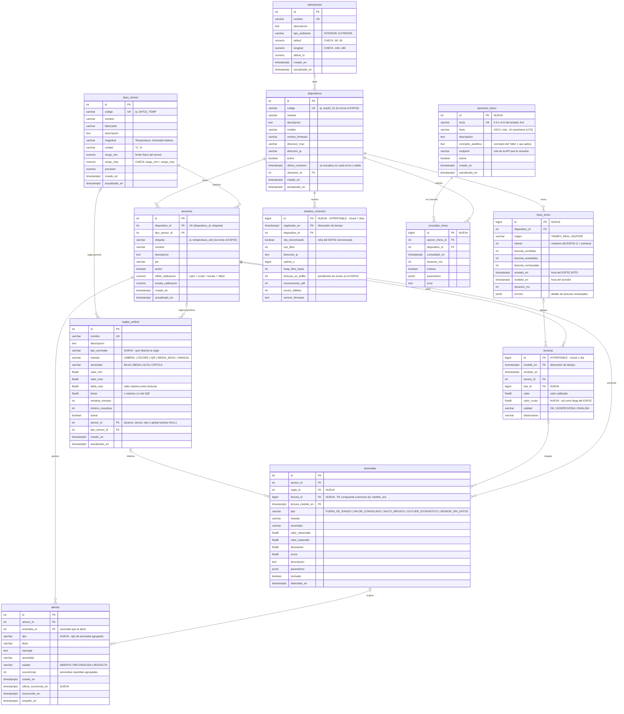

# Diagrama entidad-relación — Estación IoT (PostgreSQL + TimescaleDB en Neon)

12 tablas: 8 del esquema actual (algunas con columnas nuevas) y 4 nuevas.
Las dos tablas de serie temporal son **hypertables** de TimescaleDB.

## Para qué se usa cada tabla (todas guardan datos)

| # | Tabla | Estado | Quién escribe | Quién lee |
|---|-------|--------|---------------|-----------|
| 1 | `tipos_sensor` | existente | semilla + CRUD `/tipos-sensor` | ingesta (rango físico), detector |
| 2 | `ubicaciones` | existente | semilla + CRUD `/ubicaciones` | dispositivos, vista para KNIME |
| 3 | `dispositivos` | existente | semilla + CRUD; la ingesta actualiza `ultima_conexion` e IP | todas las consultas por `?dispositivo=` |
| 4 | `sensores` | existente | semilla + CRUD `/sensores` | ingesta (etiqueta → sensor, calibración) |
| 5 | `lotes_envio` | **nueva** | cada `POST /lecturas` del ESP32 (en línea o desde buffer) | `GET /lotes-envio`, estado de conexión |
| 6 | `lecturas` | existente | cada `POST /lecturas` | menú 1–5, KNIME, FlowiseAI |
| 7 | `estados_conexion` | **nueva** | latido del ESP32 `POST /dispositivos/:codigo/estados-conexion` | menú 7 |
| 8 | `reglas_umbral` | existente | semilla + CRUD `/reglas-umbral` | detector de anomalías |
| 9 | `anomalias` | existente (sin uso hasta ahora) | detector, al ingerir cada lote + vigilancia periódica | menú 5, `GET /anomalias` |
| 10 | `alertas` | existente (sin uso hasta ahora) | se abre/acumula desde cada anomalía | menú 6, `GET/PATCH /alertas` |
| 11 | `opciones_menu` | **nueva** | semilla (las 7 teclas) | ESP32 (títulos del LCD), tabla menú ↔ concepto de analítica |
| 12 | `consultas_menu` | **nueva** | cada consulta del teclado (`?dispositivo=`) | `GET /consultas-menu`, análisis de uso en KNIME |

## Notas de diseño

- **Hypertables**: `lecturas` (chunk de 1 día) y `estados_conexion` (chunk de 7 días).
  La justificación completa está en [`docs/timescaledb.md`](docs/timescaledb.md).
- TimescaleDB exige que la columna de tiempo forme parte de la PK; por eso ambas
  usan PK compuesta `(id, <columna de tiempo>)`.
- `lecturas` tiene además un índice único `(sensor_id, medido_en)`: un sensor
  no puede tener dos lecturas en el mismo instante, y así los reintentos del
  ESP32 no duplican datos.
- `anomalias (lectura_id, lectura_medido_en)` es una FK compuesta hacia la
  hypertable `lecturas`, que TimescaleDB 2.24 admite. Si se borra la lectura,
  la anomalía se conserva con `lectura_id = NULL`. En `SENSOR_SIN_DATOS` no hay
  lectura, así que `lectura_id` queda en NULL.
- `reglas_umbral` aplica a un sensor concreto, a todo un tipo de sensor o a
  todos (global, ambos NULL). Un CHECK impide llenar los dos a la vez, y otro
  exige los parámetros que necesita cada `tipo_anomalia`.
- `alertas` agrupa anomalías repetidas del mismo sensor y tipo: en vez de crear
  una alerta por cada lectura incrementa `ocurrencias` y `ultima_ocurrencia_en`.
  Un índice único parcial garantiza una sola alerta activa por sensor y tipo.
- La vista `v_lecturas_detalle` (no es tabla) une lecturas, sensor, tipo,
  dispositivo y ubicación para FlowiseAI.
